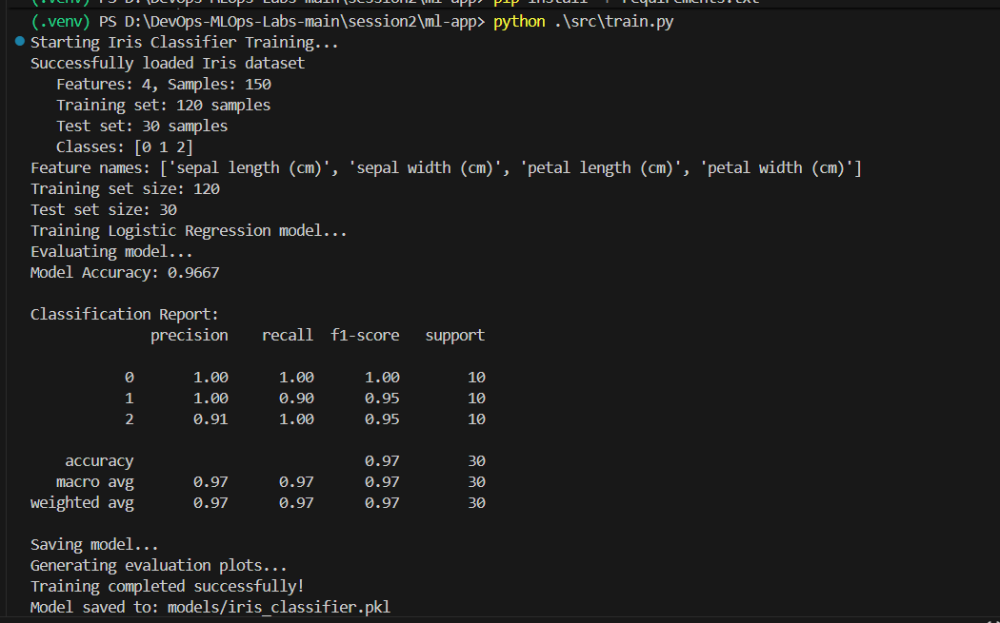
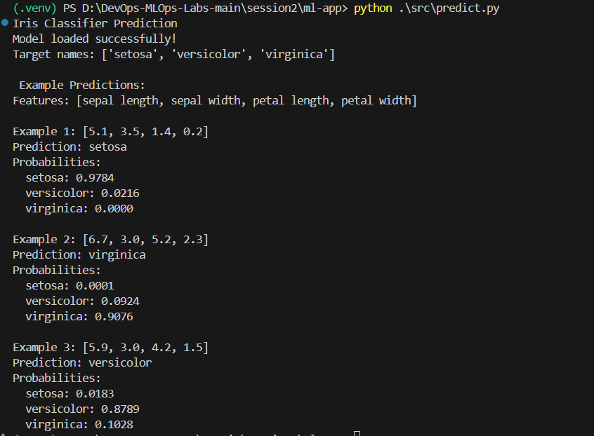
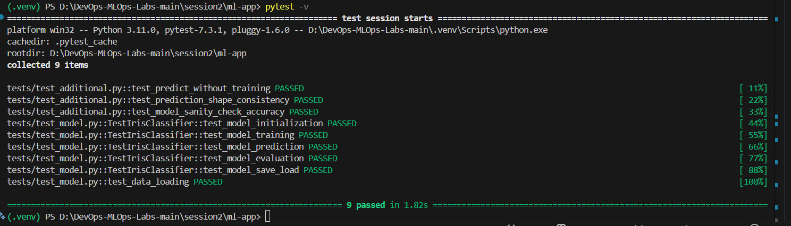
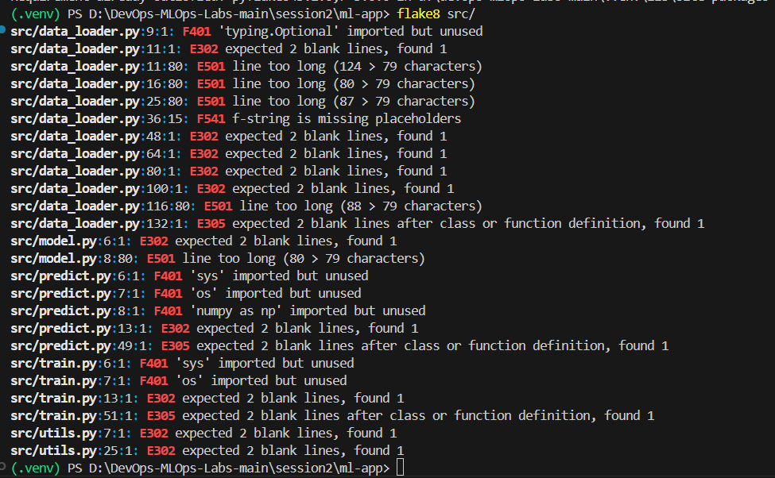
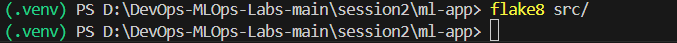
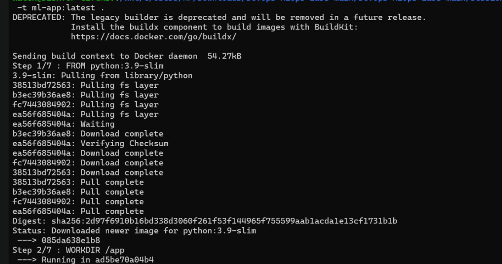
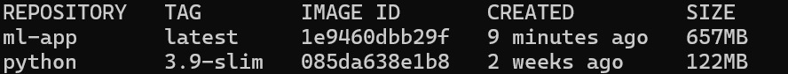
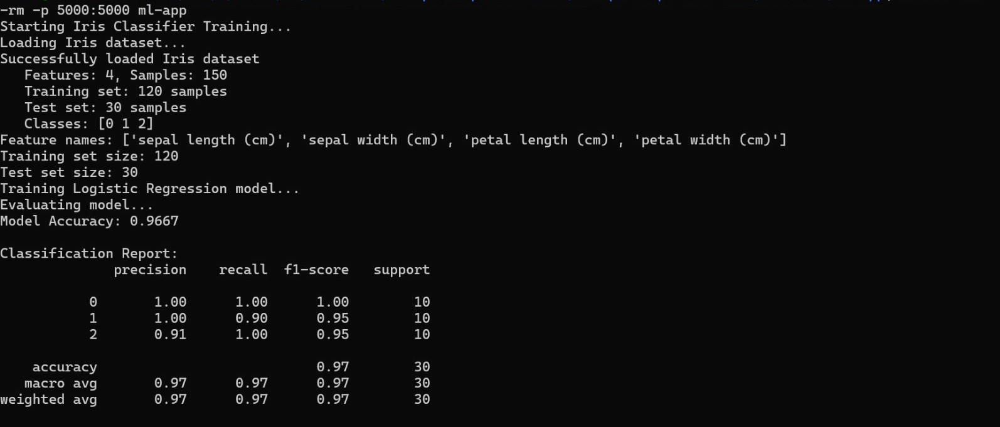

## Task 2: Run the app locally
- Virtualenv created with Python 3.11
- Dependencies installed from requirements.txt
- Model trained using `python src/train.py`
- Model tested using `python src/predict.py`

## Task 3: Write unit tests
- Added a tests/ folder with pytest tests to verify core functionality.
- Three additional meaningful tests added:
- test_predict_without_training: Ensures the model raises an exception if prediction is attempted before training.
- test_prediction_shape_consistency: Checks that predictions have the same number of elements as the input.
- test_model_sanity_check_accuracy: Verifies the model achieves a minimum accuracy (>50%) on the test set.
- Ran tests with: pytest -v

## Task 4: Linting & formatting
- Purpose: To check for PEP8 compliance, unused imports, line length, and blank line conventions.
- Issues detected:
- Unused imports (F401) in data_loader.py, predict.py, train.py.
- Missing blank lines (E302, E305) between functions/classes.
- Lines too long (E501), exceeding 79 characters.
- f-string missing placeholders (F541).

- Aprés correction des erreurs

## Task 6: Containerise the app
- Dockerfile created using python:3.11-slim as base image.
- Application source code copied to /app in the container.
- Dependencies installed from requirements.txt using pip.
- Container configured to run python src/train.py on start.
- Exposes port 5000 (or relevant app port) for external access.
- Purpose: To make the application portable and runnable on any machine with Docker.

